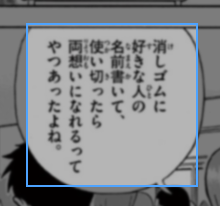
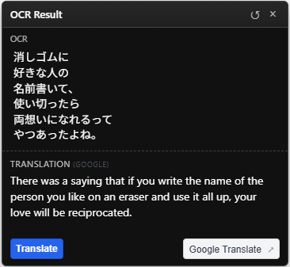
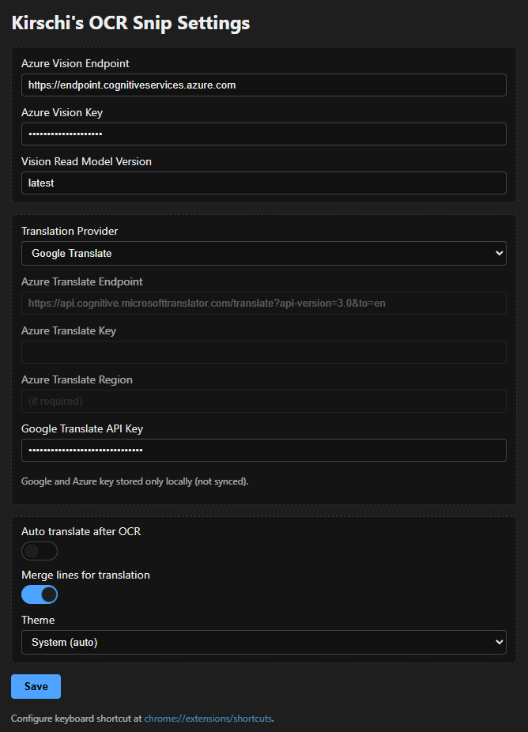

# Chrome OCR Extension

An MV3 Chrome/Edge extension that lets you draw a region on the current page, performs OCR using **Azure AI Vision (Image Analysis / Read)**, then (optionally) sends the recognized text to a translation provider (**Azure Translator** or **Google Translate API**). The recognized or translated text is overlaid inline in a small, movable bubble. Primary focus: Japanese (including vertical manga text) but it works for any language supported by Azure Vision (and translation provider). Currently only translates to `en`.

This extension is intended for developers or power users. You must provide your own Azure Vision endpoint + key, and (optionally) either an Azure Translator key/endpoint or a Google Cloud Translation API key.

  
*Snipping*

  
*Result OCR and Translation*

## Architecture

```
User Selection (content script) --> Screenshot (service worker) --> Crop (content script)
    --> Azure Vision (Read) OCR --> (Optional) Azure / Google Translation --> Overlay Bubble
```

## Current Implementation (Scaffold)

This repository contains a Manifest V3 Chrome extension scaffold that:

1. Lets you start a region selection (popup button or keyboard shortcut).
2. Captures a screenshot of the current tab and crops it client‑side to the selected rectangle.
3. Sends the cropped PNG bytes directly to Azure AI Vision (Image Analysis / Read feature).
4. Optionally sends the recognized text to the selected translation provider (Azure / Google) if configured.
5. Overlays the (translated or original) text near the selection and stores the last result in sync storage.

## File / Module Structure

The original single `content/selection.js` script has been decomposed into small modules for clarity and easier maintenance. The orchestrator now only wires the pipeline together (selection → capture → crop → OCR → translate → bubble).

```
manifest.json
background/
    service_worker.js          # Tab capture, keyboard command, ordered injection of content modules
content/
    constants.js               # Content-side MSG & STORAGE_KEYS (plain script; idempotent)
    state.js                   # Shared mutable state + getConfig() + applyTheme()
    ocr.js                     # Crop image & Azure Vision request + JSON line extraction
    translate.js               # Azure Translator helpers (auto + manual / force)
    bubble.js                  # Result bubble UI & action buttons
    overlay.js                 # Selection overlay DOM + mouse/keyboard events (ESC cancel)
    selection.js               # Orchestrator (glue) listening for START_SELECTION
    overlay.css                # Selection rectangle + bubble styles
popup/
    popup.html/.js/.css        # Popup UI to start selection & show last result
options/
    options.html/.js/.css      # Azure config, translation settings, theme choice
src/
    messages.js                # Background-side constants & defaults (ES module)
assets/icons/*.png             # Icons
README.md
```

### Module Responsibilities (Content Namespace `window.__ocrSnip`)

| Module | Responsibility | Exported Namespace |
|--------|----------------|--------------------|
| constants.js | Defines `MSG`, `STORAGE_KEYS` | `constants` |
| state.js | Stores selection/bubble state + config/theme helpers | `state`, `getConfig`, `applyTheme` |
| overlay.js | User drag selection & event lifecycle | `overlay` |
| ocr.js | Crop & Azure Vision OCR (Read) | `ocr` |
| translate.js | Auto + manual translation calls | `translate` |
| bubble.js | Display and interact with result bubble | `bubble` |
| selection.js | Orchestrates full pipeline | (no new object; uses existing namespaces) |

All modules guard against reinjection (idempotent) so multiple `executeScript` calls won't break the page.

### Orchestrated Flow Summary
1. `MSG.START_SELECTION` received → `overlay.beginSelection()` starts user drag.
2. On mouse up: selection rectangle passed to orchestrator callback.
3. Background screenshot request (`chrome.runtime.sendMessage` → `CAPTURE_TAB`).
4. Region cropped client-side → sent to Azure Vision Read (Image Analysis) via `ocr.performOcr`.
5. If auto-translate enabled, `translate.maybeTranslate` runs.
6. Result bubble shown via `bubble.showBubble` + optional manual Translate button.
7. Last result persisted (`chrome.storage.sync`).

### Why a Separate `constants.js` in Content?
The background script imports `src/messages.js` as an ES module. Content scripts remain classic scripts for now (simpler injection & compatibility). Duplicating constants avoids needing to convert all content scripts to ES modules immediately. You can unify later by switching to module-type content scripts and importing from a shared file.

## Permissions Rationale

| Permission | Reason |
|------------|--------|
| storage    | Persist user configuration & last result |
| scripting  | Inject content script & CSS on demand for selection |
| tabs + activeTab      | Required for `chrome.tabs.captureVisibleTab` screenshot |

If you later implement the OCR entirely in-page (e.g. WebAssembly) and drop screenshot capture, you may be able to remove or reduce some permissions. Thanks to the modular layout, you would mostly swap out `ocr.js` and adjust the orchestrator.

## Keyboard Shortcut

Default: `Ctrl+Shift+S` (Win/Linux) / `Command+Shift+S` (macOS)

You can customize it via `chrome://extensions/shortcuts`.

## Configuration (Options Page)

Open the extension's options or visit the popup and click "Settings". Fields:

Azure AI Vision Section:
* Azure Vision Endpoint (e.g. `https://<resource>.cognitiveservices.azure.com`).
* Azure Vision Key.
* Vision Read Model Version (default `latest`).

Translation Section:
* Translation Provider: `Azure` or `Google`.
* If Azure selected:
    * Azure Translate Endpoint (full URL incl. `api-version` & `to=<lang>` query; default targets English).
    * Azure Translate Key & (optional) Region.
* If Google selected:
    * Google Cloud Translation API Key (server key or restricted browser key with Translate permission). Endpoint is implicit.
* Auto translate toggle – if disabled, only OCR text is displayed (manual translation button still appears if provider configured).
* Merge lines for translation toggle – when enabled, newline characters from OCR are collapsed before translation.

The last OCR/translation result is stored (shortened) and shown in the popup.

  
*Options*

### Theme Support

The extension supports Light, Dark, or System (automatic) theme selection. Choose your preference on the Options page. System mode tracks the browser / OS `prefers-color-scheme` and switches automatically. Themed surfaces include:
* Options page UI
* Popup window
* On‑page selection rectangle & result bubble

Implementation notes: a `uiTheme` key is stored in `chrome.storage.sync`; when set to `system` a runtime media query resolves to light/dark. Styles rely on CSS custom properties (`--*`) so additional themes (e.g. Sepia, High Contrast) can be added by introducing new data-theme blocks.

## OCR Provider

Currently only Azure AI Vision (Read) is supported. Adding additional OCR providers (e.g. local WASM models or other cloud APIs) would involve introducing a new `ocr_<provider>.js` module and branching inside `selection.js`.

## Azure AI Vision OCR (Enforced Mode)

When configured, the extension posts the raw PNG bytes (cropped selection) to the Azure Vision Image Analysis (Read feature) endpoint:

`POST {endpoint}/computervision/imageanalysis:analyze?api-version=2024-02-01&features=read&model-version=<MODEL>`

Headers:
```
Ocp-Apim-Subscription-Key: <VISION_KEY>
Content-Type: application/octet-stream
```

Body: Binary image data (PNG) extracted from the screenshot region.

Response (simplified) contains `readResult` with blocks/pages -> lines; lines are concatenated with newlines for display.

Model Version: You can override to newer preview GA versions as Azure releases them.

Rate Limits: Be mindful of per-second call limits on your pricing tier; rapid selections may hit limits.

Fallback: If Vision key/endpoint are missing the extension displays an error bubble; no alternate provider exists.

## Translation Providers

The extension can translate via Azure Translator or Google Cloud Translation API, selected on the options page.

### Azure Translation Call

If auto-translate + key configured, the extension POSTs to the Azure endpoint (e.g.:
`https://api.cognitive.microsofttranslator.com/translate?api-version=3.0&to=en`).

Body:
```
[{ "Text": "<OCR RESULT>" }]
```
Headers:
```
Ocp-Apim-Subscription-Key: <KEY>
Ocp-Apim-Subscription-Region: <REGION?>
Content-Type: application/json; charset=UTF-8
```

Response (trimmed example):
```
[
    {
        "translations": [ { "text": "Translated text", "to": "en" } ]
    }
]
```

If translation fails, the original OCR result is still shown.

### Google Translation Call (When Selected)

When Google is selected and a key is provided, the extension sends the OCR text to the Google Cloud Translation API endpoint:

`POST https://translation.googleapis.com/language/translate/v2`

Headers:
```
Content-Type: application/json; charset=UTF-8
```
Body (simplified):
```
{ "q": "<OCR RESULT>", "target": "en", "format": "text", "source": null, "key": "<GOOGLE_API_KEY>" }
```
Note: The current implementation builds the request internally (see `translate.js`). Language target is inferred from the Azure style endpoint query when using Azure, and from configuration / defaults when using Google (future enhancement may surface explicit language select UI). Error behavior matches Azure flow: failure leaves original OCR text intact.

## How to Load the Extension (Unpacked)

1. Build step: none (plain JS/CSS/HTML currently).
2. Open Chrome / Edge -> `chrome://extensions`.
3. Enable Developer Mode (top right).
4. Click "Load unpacked" and select the project folder.
5. (Optional) Adjust shortcut at `chrome://extensions/shortcuts`.

## Usage

1. Press the keyboard shortcut or click the toolbar icon then "Start Selection".
2. Drag a rectangle over the desired text region. Release mouse.
3. A bubble shows: "Processing OCR..." then the recognized (and optionally translated) text.
4. Bubble auto-closes after a few seconds; last result stored for quick reference in popup.
5. Press Esc while selecting to cancel.

## Customization Ideas / Next Steps

- Add TypeScript build pipeline (Vite / esbuild) for future complexity.
- Add vertical-text specialized OCR pre-processing (binarization, rotation hints) on backend.
- Implement in-extension translation provider switcher.
- Add copy-to-clipboard & pin bubble features.
- Provide loading spinner or progress states.
- Internationalize extension UI.

## Security / Privacy Notes

Core data flows:
* Cropped images (just the selected rectangle, not the full page) are sent only to your configured Azure Vision endpoint over HTTPS.
* Only extracted text (never images) is sent to the translation provider (Azure or Google) if translation is enabled.
* No analytics, telemetry, or third‑party tracking scripts are included; network calls are limited to the user‑configured Azure endpoints and Google's translation endpoint when that provider is chosen.

Storage & sync behavior:
* API keys and endpoints you enter are stored in `chrome.storage.sync`, which means they are synchronized across Chrome/Edge profiles where you are signed in with sync enabled. They are not end‑to‑end encrypted; treat them as moderately sensitive.
* If you prefer strictly local storage, you (or a future version) can switch to `chrome.storage.local` with a minor code change.
* The last OCR/translation result (text only) is stored (overwriting the previous one). No historical log or images are kept.
* Avoid using the tool on sensitive, personal, regulated, or confidential material you do not wish to transmit to cloud services.

Service Terms & Costs:
* Use of Azure AI Vision, Azure Translator, and Google Cloud Translation APIs is subject to their respective Terms of Service and billing. You are responsible for any charges incurred.
* API rate limits (throttling) may apply; rapid or automated use could lead to quota errors.

Threat considerations:
* Keys in sync storage could be exfiltrated by any other locally installed malicious extension granted `storage` access (low likelihood but possible). For higher assurance, consider using short‑lived proxy tokens or local storage and disabling sync.
* All injected DOM elements are text‑only (no HTML injection of OCR/translation output).

## Troubleshooting

| Issue | Possible Cause | Fix |
|-------|----------------|-----|
| Blank result | OCR backend empty response | Check backend logs / ensure it returns `{ text: "..." }` |
| Translation missing | Key/region not set or endpoint incorrect | Verify options page entries |
| Selection overlay never appears | Content script injection blocked | Reload tab or re-install extension |
| Screenshot fails | Permission / protected page | Try a normal HTTP(S) page, some chrome:// pages are restricted |

## Special thanks

Thanks to AI coding assistants (GitHub Copilot and similar tools) for development acceleration.

## Disclaimer / Trademarks

This project is an independent, community-created extension. It is **not** affiliated with, endorsed by, or sponsored by Microsoft, Google, or the Chromium project. 

"Azure", "Azure AI Vision", "Azure Translator" are trademarks or registered trademarks of Microsoft Corporation. "Google Cloud", "Google Translate", and the Google logo are trademarks of Google LLC. "Chrome" and the Chromium logo are trademarks of Google LLC. All other trademarks are the property of their respective owners. Use of the APIs and services referenced is subject to their own terms.

## License

MIT License

Copyright (c) 2025 Stefan 'Kirschi' Kirchsteiger

Permission is hereby granted, free of charge, to any person obtaining a copy
of this software and associated documentation files (the "Software"), to deal
in the Software without restriction, including without limitation the rights
to use, copy, modify, merge, publish, distribute, sublicense, and/or sell
copies of the Software, and to permit persons to whom the Software is
furnished to do so, subject to the following conditions:

The above copyright notice and this permission notice shall be included in all
copies or substantial portions of the Software.

THE SOFTWARE IS PROVIDED "AS IS", WITHOUT WARRANTY OF ANY KIND, EXPRESS OR
IMPLIED, INCLUDING BUT NOT LIMITED TO THE WARRANTIES OF MERCHANTABILITY,
FITNESS FOR A PARTICULAR PURPOSE AND NONINFRINGEMENT. IN NO EVENT SHALL THE
AUTHORS OR COPYRIGHT HOLDERS BE LIABLE FOR ANY CLAIM, DAMAGES OR OTHER
LIABILITY, WHETHER IN AN ACTION OF CONTRACT, TORT OR OTHERWISE, ARISING FROM,
OUT OF OR IN CONNECTION WITH THE SOFTWARE OR THE USE OR OTHER DEALINGS IN THE
SOFTWARE.
